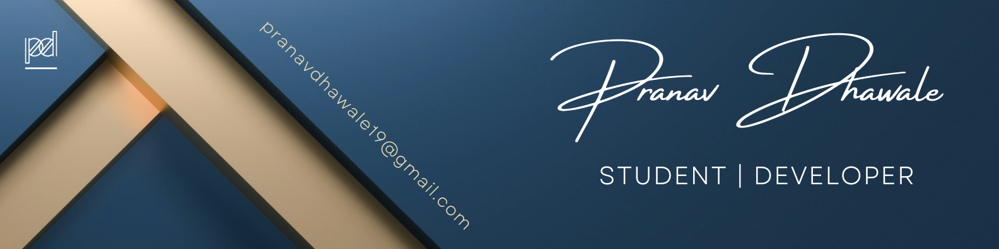

  

# Hola Amigos,  I'm Pranav Dhawale 👋

## About Me: 🤗

- 📚 I’m currently exploring DevOps & Cloud ☁️
- 🥅 2024 Goals: Learn more about Docker and Kubernetes 🧑‍💻
- 👯 I’m looking to collaborate on Real World Applications 😃
- ⚡ Fun fact: I ❤️ to Eat 🍽️ and Travel 🧳
- 🎓 Education: Pursing B.Tech Computer Engineering at <abbr title="MUKESH PATEL SCHOOL OF TECHNOLOGY MANAGEMENT & ENGINEERING">MPSTME</abbr> 🖥️

### Languages: 🧰

### Frameworks: 🏗️

### Database: 🗃️

### Technologies: ⚙️

## Connect with me: 💻

---

### ⚡ Recent Activity

<!--START_SECTION:activity-->

---

<h2>🔥 GitHub Stats</h2>

  

