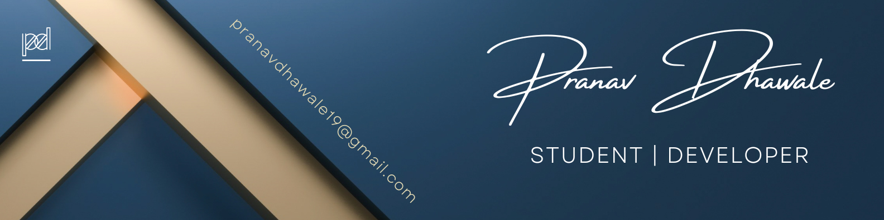

# नमस्कार 🙏🏻  I'm Pranav Dhawale 

## About Me: 🤗

- 📚 I’m currently exploring DevOps & Cloud ☁️
- 🥅 2026 Goals: Learn more about Network 🧑‍💻
- 👯 I’m looking to collaborate on Server Architecture & Networking 😃
- ⚡ Fun fact: I ❤️ to Eat 🍽️ and Travel 🧳
- 🎓 Education: Pursing B.Tech Computer Engineering at NMIMS's MUKESH PATEL SCHOOL OF TECHNOLOGY MANAGEMENT & ENGINEERING 🖥️

### Languages: 🧰

### Frameworks: 🏗️

### Database: 🗃️

### Technologies: ⚙️

## Connect with me: 💻

---

<h2>🔥 GitHub Stats</h2>

  

